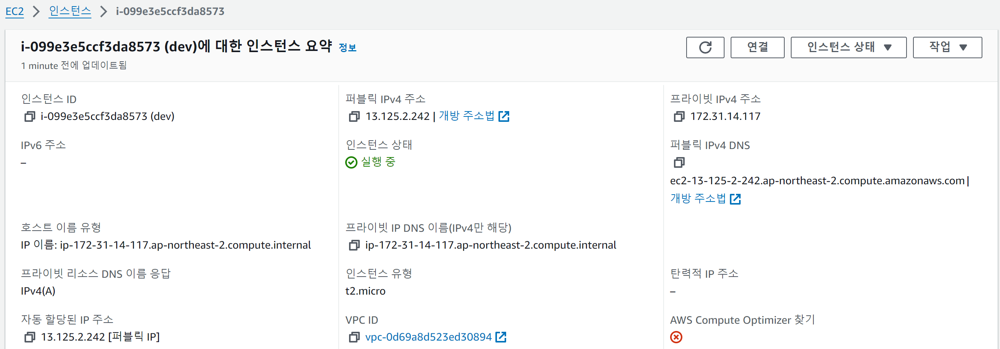
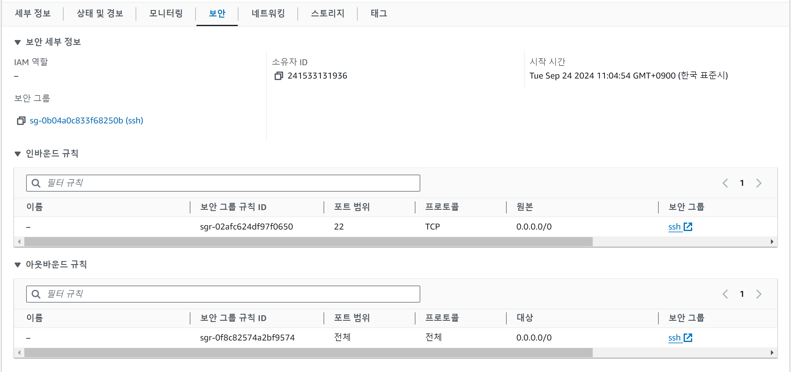
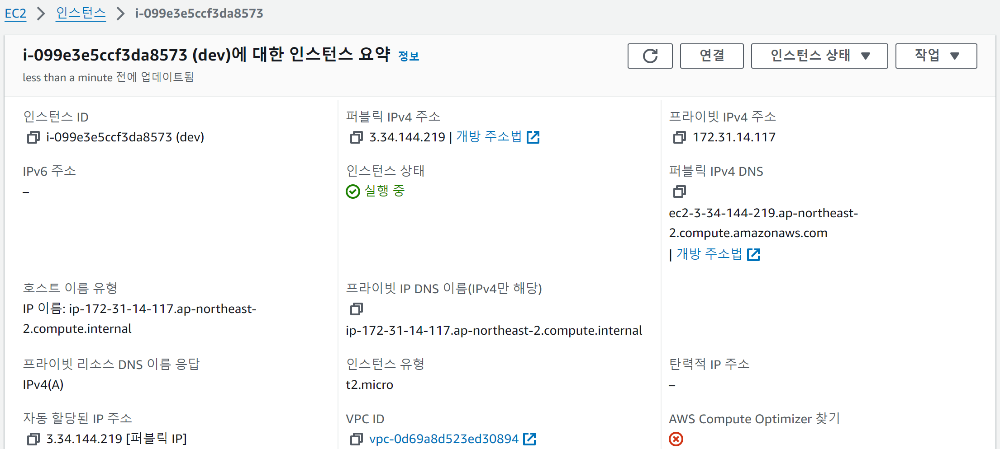
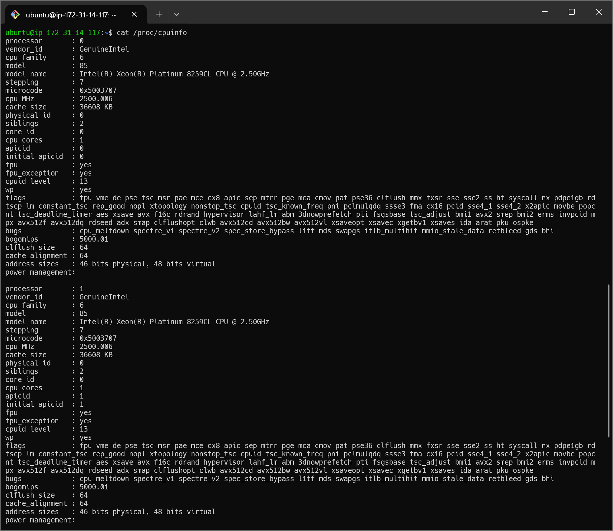
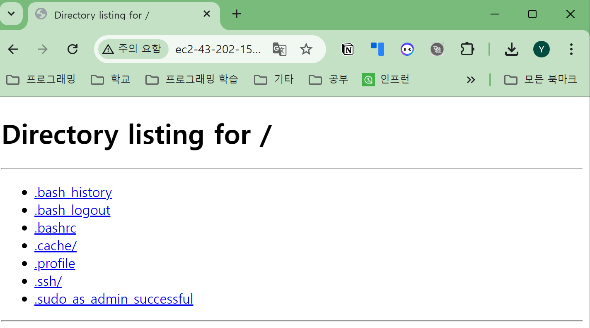
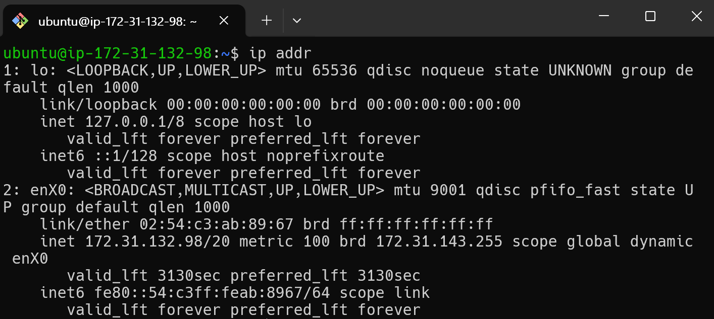
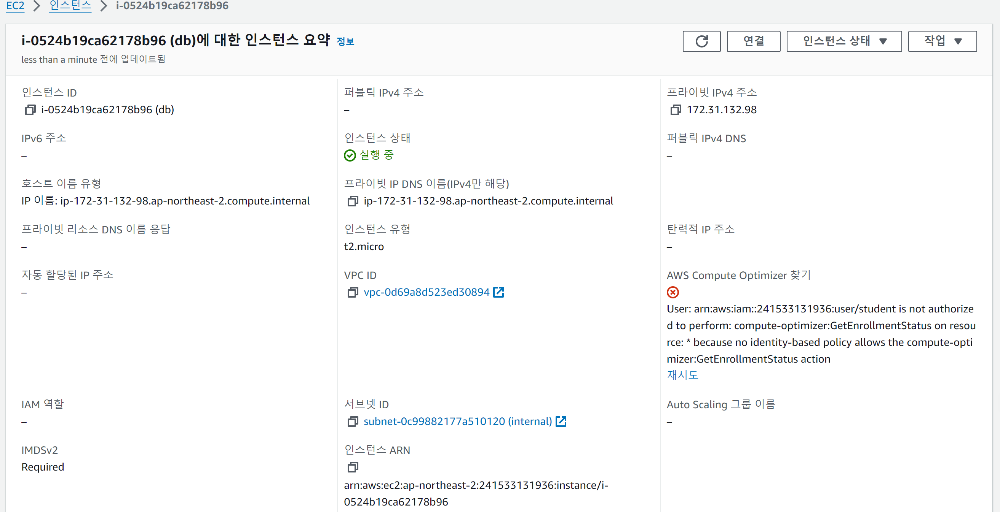
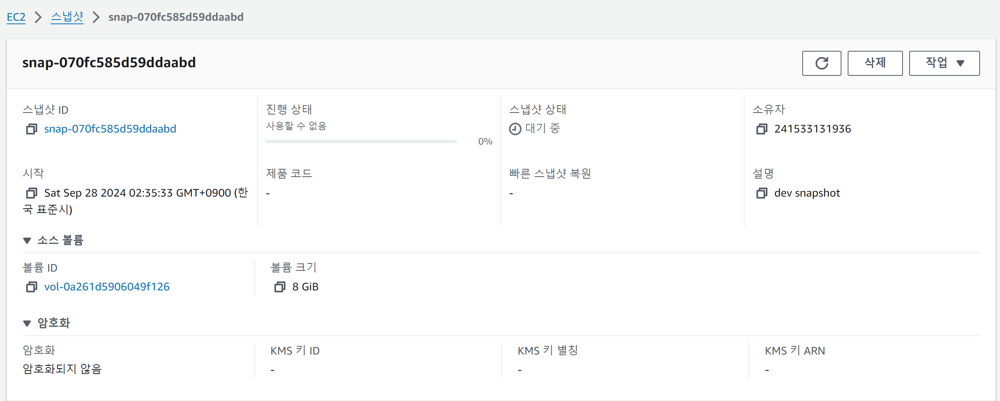

# 실습2 - AWS

제출자: 60222101 신예림

## 제출물 #1
- VM의 IP

- VM의 보안 규칙

## 제출물 #2
- 재시작 후 VM의 IP

## 제출물 #3
- Elastic IP 부여 후 VI의 IP

## 제출물 #4
- 인스턴스 유형 변경 후 cpuinfo 출력

## 제출물 #5
- public IP로 http 접속

## 제출물 #6
- 두 번째 서버 접속 후 ip addr 실행 결과

- db VM의 정보

## 제출물 #7
- 스냅샷 생성 결과
