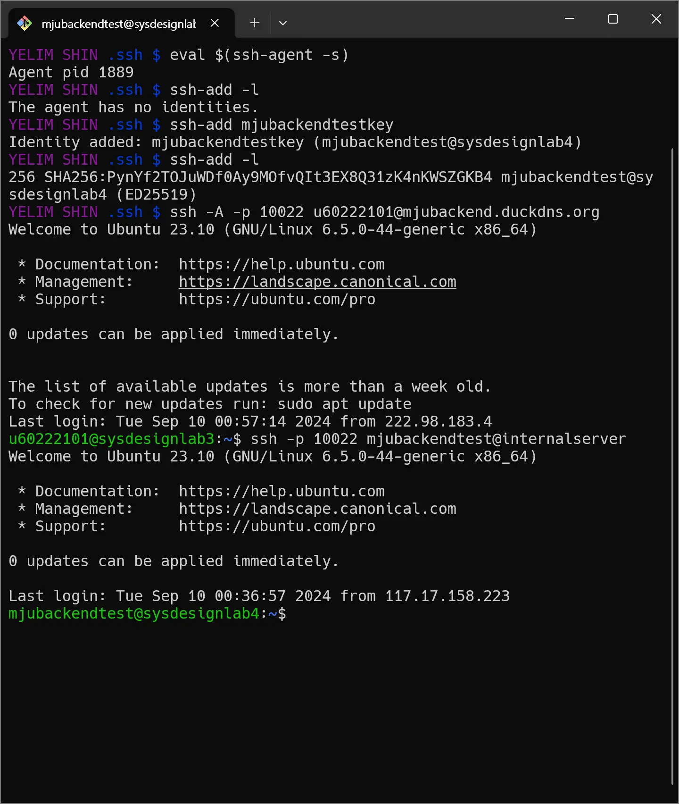

# 실습1

1.본인의 github private repo URL
https://github.com/yyyeee1108/mjubackend_60222101

2.Page #43 의 ssh -A 실습 화면 스크린샷. 다음 명령어들이 나와야 함  
한 화면에 나오지 않을 경우 여러장으로 스크린샷을 찍을 것

3.다음 질문들에 대한 대답과 설명

① 실습 서버에서 생성한 .ssh/id_ed25519 를 삭제할 경우 개인 노트북에서 ssh 할 때 문제가 발생하는가?  
결과에 대해 이유를 설명하라.

    문제가 발생하지 않는다.
    개인 노트북의 ~/.ssh에 저장된 ed25519 파일(id_ed25519를 ed25519로 바꾼 상태)을 -i로 지정한 후 접속하면 정상 접속된다.
    이유는 개인 노트북의 ed25519와 실습 서버의 authorized_keys에 등록된 id_ed25519.pub 키가 매칭되기 때문이다.
    실습 서버에서 이미 id_ed25519.pub을 authorized_keys에 등록했다면 개인 노트북에서 매칭되는 private key를 이용할 때 정상 접속된다.

② 이번에는 실습 서버에서 .ssh/id_ed25519.pub 을 삭제하는 경우 어떻게 되는가?  
역시 결과에 대한 이유를 설명하라.

    문제가 발생하지 않는다.
    앞선 실습에 따르면 개인 컴퓨터에는 private key인 ed25519(id_ed25519)가 저장되어있고, 실습 서버의 authorized_keys에는 개인 컴퓨터의 ed25519와 매칭되는 id_ed25519.pub이 등록된 상태이다.
    실습 서버에서 .ssh/id_ed25519.pub을 삭제해도 authorized_keys에 등록된 상태였기 때문에 문제없이 접속 가능하다.

③ 개인 노트북에서 생성한 .ssh/id_rsa 를 삭제할 경우 개인 노트북에서 ssh 할 때 문제가 발생하는가?  
역시 결과에 대한 이유를 설명하라.

    문제가 발생한다. 비밀번호를 물어본다.
    현재 실습 서버의 authorized_keys에는 id_ed25519.pub과 id_rsa.pub이 등록돼있다.
    개인 노트북의 .ssh에는 실습 서버의 authorized_keys에 등록한 pub 키와 매칭되는 ed25519, id_rsa 2개의 private key가 있다.

    id_rsa키를 삭제하지 않았을 땐, private key 명시하지 않고 접속 시도 시(ssh -p 10022 u60222101@mjubackend.duckdns.org 명령 수행) ssh는 id_rsa라는 잘 알려진 이름을 찾아 접속하므로 바로 접속 가능하다
    이때, ed25519는 id_ed25519라는 잘 알려진 이름의 파일로 있지 않기 때문에 ssh는 id_rsa로 접속한다

    개인 노트북에서 id_rsa를 삭제한다면 개인 노트북에는 ed25519 private key만 남게 된다. 이는 id_ed25519같이 알려진 이름이 아니므로 ssh 접속 시 -i로 ed25519를 따로 명시하지 않으면 비밀번호를 물어볼 것이다.

    만약 ed25519를 다시 id_ed25519로 바꾼다면 잘 알려진 이름이기 때문에 ssh는 이 파일을 찾아 실습 서버에 비밀번호 없이 접속시킬 것이다.

④ 개인 노트북에서 생성한 .ssh/id_rsa.pub 을 삭제할 경우 어떻게 되는가?  
역시 결과에 대한 이유를 설명하라.

    문제 없이 접속된다. 개인 노트북에 id_rsa private key가 있고, 실습 서버에는 이와 매칭되는 id_rsa.pub키가 authorized_keys에 등록돼있기 때문이다.
